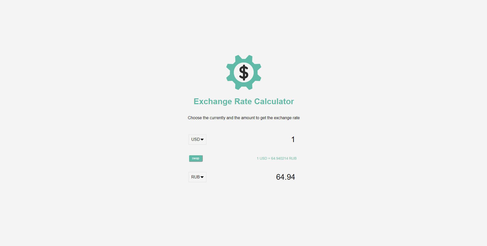

# Exchange Rate Calculator
"An app to show the exchange rate of money between two different places"

## Site URL
https://nick-hernstedt.github.io/ExchangeRateCalculator/

##

## What it is
This exchange rate calculator is a website that aims to inform. It does the following:
- allows the user to select two different countrys
- allows the user to choose how much money they would like to see the exchange rate for
- provides the rate of exchange from the first selected country to the amount it would be worth in the second selected country

## Technologies
- Responsive Design
- HTML
- CSS 
- JavaScript

## APIs
> Exhange rates from API: https://api.exchangerate-api.com/

## User story
AS A person who is traveling,
I WANT to find an easy-to-use website that will show me the exhange rate for some money without too many buttons or confusing UI elements,
SO THAT I can see how much the money that I have is worth in another country.

GIVEN a website that will give me the exchange rate,

WHEN I choose 2 particular countries,
THEN I am shown the exchange rate between them.

